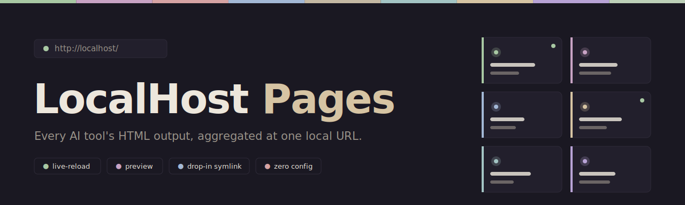

<p align="center">
  
</p>

An always-on local web server that aggregates HTML output from many small AI scripts and tools into one place. Each tool registers by symlinking its output directory into `symlinks/`, and a card for it appears at `http://localhost/`.

- **Index page** at `/` lists every registered app as a card.
- **Per-app URLs** at `/<app-name>/` serve the linked directory.
- **Auto-reload** — open tabs refresh whenever any file in the linked directory changes (SSE-driven, survives bfcache restores).
- **No registration UI** — drop a symlink, you're done.

## Demo

https://github.com/user-attachments/assets/b31679c5-5bea-4dab-9dd4-a9287e685a33

## Features

- **Live-reloading previews** — open tabs refresh automatically when files change. Cards on the index show a "new since you last visited" marker.
- **Preview without leaving the index** — clicking a card opens it in a centered preview modal; press `f` (or the maximize button) to jump to the full page, Esc / backdrop / browser-back to close.
- **Fast filtering & sorting** — type-to-filter search, plus sort by alphabetical, recently updated, recently visited, most-visited, or your own manual order.
- **Pin and reorder** — pin favourites to the top, or drag cards into the order you want in edit mode.
- **Keyboard-driven** — arrow keys to move between cards, Enter to open, with a `?` cheatsheet overlay for the rest.
- **Per-app branding** — each app picks its own title, icon (Lucide, inline SVG, or emoji), and accent colour via a small `meta.json`. Accent is auto-assigned from a curated 32-colour muted-pastel palette by hashing the app name; every colour has a name (`sage`, `mauve`, `rose`, `powder`, `sand`, `mist`, `peach`, `lavender`, …) so an app can pin its colour explicitly. See [AGENTS.md](./AGENTS.md) for the full list.
- **Clean look** — brutalist monospaced design (JetBrains Mono), muted pastel palette, scales cleanly with browser zoom.
- **Manage from the UI** — delete an app (removes the symlink) directly from its card.
- **Drop-in registration** — no UI, no config: symlink a directory into `symlinks/` and it appears. See [AGENTS.md](./AGENTS.md) for the `meta.json` schema.
- **Always-on installers** — one-shot scripts for launchd (macOS), systemd --user (Linux), and Scheduled Tasks (Windows).

## Install

Requires Python 3.12+ and [`uv`](https://docs.astral.sh/uv/).

```bash
git clone https://github.com/Himel55/localhost-pages.git
cd localhost-pages
uv sync
```

## Run (foreground)

```bash
uv run python -m localhost_pages
# → http://127.0.0.1:8080/
```

### Configuration (env vars)

All optional:

| Variable                    | Default                        | Purpose                                       |
| --------------------------- | ------------------------------ | --------------------------------------------- |
| `LOCALHOST_PAGES_SYMLINKS`  | `<repo>/symlinks/`             | Where registered app symlinks live.           |
| `LOCALHOST_PAGES_HOST`      | `127.0.0.1`                    | Bind address.                                 |
| `LOCALHOST_PAGES_PORT`      | `8080`                         | Listening port.                               |
| `LOCALHOST_PAGES_LOG`       | _(stderr)_                     | If set, log to this file path instead.        |

Example:

```bash
LOCALHOST_PAGES_PORT=80 LOCALHOST_PAGES_SYMLINKS=/srv/pages uv run python -m localhost_pages
```

## Telling an AI agent to register itself

Once the server is running, point any agent (Claude Code, Codex, Cursor, etc.) at [`AGENTS.md`](./AGENTS.md) and ask it to register the HTML output of whatever it's building. Example prompt:

> Read `AGENTS.md` in the localhost-pages repo, then register this app's HTML output following those instructions.

## Always-on install

> ⚠️ **Platform status:** Developed and tested on **macOS**. The Linux and Windows paths (installers, port-80 setup, symlink registration) are implemented but **not yet tested** — treat them as provisional and please report issues.

### macOS (launchd)

```bash
./scripts/install-launchd.sh
```

Renders `scripts/launchd.plist.template` for your environment, installs it to `~/Library/LaunchAgents/localhost-pages.plist`, and loads it. Logs: `~/Library/Logs/localhost-pages.log`. Override the agent label with `LOCALHOST_PAGES_LABEL=...`.

Stop: `launchctl unload ~/Library/LaunchAgents/localhost-pages.plist`

### Linux (systemd --user)

```bash
./scripts/install-systemd.sh
```

Renders `scripts/localhost-pages.service.template` to `~/.config/systemd/user/localhost-pages.service` and enables it. Logs: `journalctl --user -u localhost-pages -f`. Override the unit name with `LOCALHOST_PAGES_UNIT=...`.

To keep the service running when you're not logged in:

```bash
sudo loginctl enable-linger "$USER"
```

Stop: `systemctl --user stop localhost-pages`

### Windows (Scheduled Task)

```powershell
powershell -ExecutionPolicy Bypass -File scripts\install-task.ps1
```

Registers a Scheduled Task that runs at user logon and restarts on failure. Logs: `%LOCALAPPDATA%\localhost-pages\localhost-pages.log`. Override the task name with `$env:LOCALHOST_PAGES_TASK` and the port with `$env:LOCALHOST_PAGES_PORT`.

Stop: `Stop-ScheduledTask -TaskName localhost-pages`

## Serving on port 80

The server defaults to port `8080`. To reach it at the bare `http://localhost/`:

### macOS (`pf` redirect, recommended)

```bash
sudo pfctl -ef scripts/pf-anchor.conf
# → http://localhost/
```

This redirects port 80 → 8080 without running the server as root. For persistence across reboots, install the rule into `/etc/pf.anchors/localhost-pages` and reference it from `/etc/pf.conf`. See `pf.conf(5)`.

### Linux (reverse proxy, recommended)

Front the server with caddy, nginx, or Traefik. Minimal Caddyfile:

```caddy
:80 {
    reverse_proxy 127.0.0.1:8080
}
```

Alternative — run on port 80 directly with `LOCALHOST_PAGES_PORT=80` in your service unit, then either:

- run as root (not recommended), or
- grant the binary the bind-low-ports capability:

  > ⚠️ **Warning:** `setcap` applies to the underlying CPython binary, which is shared by every Python script run with that interpreter. On a multi-user or shared machine this is a privilege-escalation risk. Prefer the reverse-proxy option above.
  >
  > ```bash
  > sudo setcap 'cap_net_bind_service=+ep' "$(readlink -f "$(uv run which python)")"
  > ```

### Windows

Set `$env:LOCALHOST_PAGES_PORT = "80"` before running `install-task.ps1` (or set it in the launcher `.cmd`). Windows lets unprivileged users bind low ports — just make sure nothing else (IIS, Skype, etc.) owns port 80.

## Registering an app

See [AGENTS.md](./AGENTS.md) for the full protocol. Quick reference:

```bash
# macOS / Linux — from the repo root:
ln -s /path/to/your-app/output ./symlinks/your-app
```

```cmd
:: Windows — from the repo root, in an admin shell (or Developer Mode):
mklink /D symlinks\your-app C:\path\to\your-app\output
```

Then visit `http://localhost/your-app/` (or `:8080` if you haven't set up port 80).

## Tests

```bash
uv run pytest
```

## License

MIT — see [LICENSE](./LICENSE).
